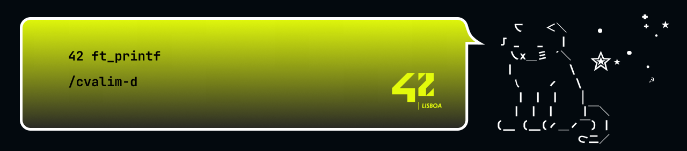

# 42ft_printf

## Project Description

The ft_printf is a pretty straight-forword project at 42 School where we need to create our own version of the printf function in C, implementing various formatting options from scratch.

## Functions

### ft_printf
***

#### `int ft_printf(const char *format_string, ...);`
|               Description               |            Param. #1             |              Return Value               |
| :-------------------------------------: | :------------------------------: | :-------------------------------------: |
| Custom implementation of printf function | `format_string` - Format string with specifiers | Number of characters printed |

### parse_arguments
***

#### `int parse_arguments(const char *type, va_list args);`
|               Description               |            Param. #1             |              Param. #2               |              Return Value               |
| :-------------------------------------: | :------------------------------: | :----------------------------------: | :-------------------------------------: |
| Parses the arguments based on the format specifier | `type` - The format specifier | `args` - The list of arguments | Number of characters written |

### print_arguments
***

#### `int print_arguments(long n, long base, int uppercase, int is_pointer);`
|               Description               |            Param. #1             |              Param. #2               |              Param. #3               |              Param. #4               |              Return Value               |
| :-------------------------------------: | :------------------------------: | :----------------------------------: | :----------------------------------: | :----------------------------------: | :-------------------------------------: |
| Converts argument to the specified base and writes it to the standard output | `n` - The number to be converted | `base` - The base | `uppercase` - The flag to convert to uppercase | `is_pointer` - The flag to convert to a pointer | Number of characters written |

### ft_putstr
***

#### `int ft_putstr(char *s);`
|               Description               |            Param. #1             |              Return Value               |
| :-------------------------------------: | :------------------------------: | :-------------------------------------: |
| Writes the string to the standard output | `s` - The string to be written | Number of characters written |
